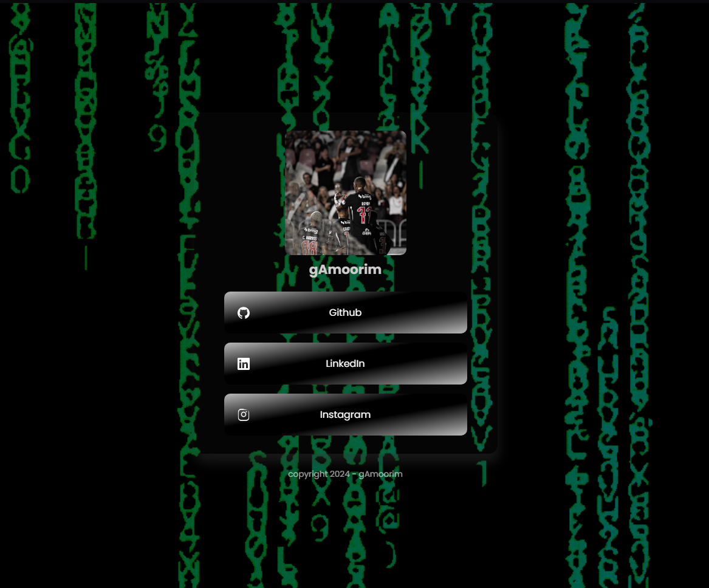

# Card de Links

Um projeto simples e elegante de **card de links**, desenvolvido com **HTML e CSS**, ideal para centralizar suas redes sociais e links importantes em uma única página.

## 📸 Preview

<!-- Adicione uma imagem do projeto -->


## 🚀 Tecnologias utilizadas

- HTML5
- CSS3

## 🎯 Objetivo

Este projeto tem como objetivo criar um **cartão de perfil com links clicáveis**, permitindo compartilhar múltiplos links de forma organizada e visualmente agradável.

## 💻 Como usar

1. Clone o repositório:

```bash
git clone https://github.com/seu-usuario/card-de-links.git

```
2. Abra o arquivo index.html no navegador.
